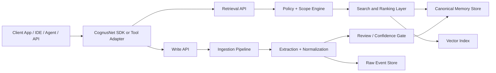

# CognusNet Architecture

## Summary

CognusNet is a shared memory layer for AI systems. It sits around model execution, retrieves the most relevant context before a model answers, and writes durable knowledge back after the interaction. The product is designed to work across three domains:

- Personal memory: long-lived user preferences, facts, goals, and history
- Enterprise memory: shared organizational knowledge, decisions, and source-backed facts
- Coding memory: codebase conventions, architecture knowledge, prior implementation decisions, and usage patterns

The initial product focus is coding and team memory because it has the strongest distribution through API and IDE workflows, and the lowest ambiguity around data shape.

## Problem Statement

AI systems repeatedly lose context between conversations, sessions, and tools. This is especially severe in API-based usage where prior messages cannot be assumed and where multi-step agent workflows must reconstruct context from scratch. Teams also struggle to keep documentation current, which means valuable operational and architectural knowledge remains trapped in conversations, code reviews, tickets, and individual memory.

CognusNet addresses this by turning repeated AI interactions into a persistent, queryable memory system with explicit permissions, tenant isolation, and retrieval quality controls.

## Product Goals

- Provide persistent memory across AI sessions, tools, and users
- Reduce manual documentation burden by capturing durable knowledge during normal work
- Improve model outputs by retrieving relevant project, team, or personal context at execution time
- Support shared team memory with strong tenancy, auditability, and deletion guarantees
- Expose a neutral infrastructure layer that can work with multiple model vendors and clients

## Non-Goals For V1

- Replacing all enterprise content systems on day one
- Full autonomous knowledge extraction from every enterprise source
- Training or fine-tuning proprietary base models
- Building a general-purpose personal assistant before team and coding workflows work well

## Design Principles

- Durable memory over chat history: store long-lived knowledge, not raw transcript noise
- Retrieval quality over ingestion volume: irrelevant memories reduce trust faster than missing memories
- Source-backed memory: every shared memory item should retain provenance
- Human-governed when needed: low-confidence or high-impact memories should be reviewable
- Tenant safety first: permissions and isolation are part of the core architecture
- Integration-neutral: the platform must work through SDKs, APIs, agent tools, or MCP-compatible interfaces

## System Context

At runtime, CognusNet surrounds an AI interaction:

1. A client submits a request to an LLM through an application, SDK, agent, or tool.
2. Before model execution, the client asks CognusNet for the most relevant memory for the current scope.
3. The client includes the returned memory in the model context or tool chain.
4. During or after execution, the client sends interaction artifacts back to CognusNet.
5. CognusNet extracts durable knowledge, stores canonical memory, and records provenance.

## High-Level Architecture

## Core Components

### 1. Client Integration Layer

The client integration layer provides the runtime hooks that make CognusNet useful during model execution.

Interfaces:

- SDK for server-side API applications
- Agent tool or function call interface for retrieval and write-back
- MCP-compatible server for local developer workflows where that interface is useful
- IDE and workflow adapters over time

Responsibilities:

- Collect request metadata such as tenant, user, project, repository, task, and interaction type
- Fetch relevant memory before the model runs
- Submit post-interaction data for extraction and storage
- Enforce least-privilege access tokens and scoped memory access

### 2. Retrieval API

The retrieval API returns ranked memory items for a given request context.

Core inputs:

- Tenant ID
- User ID or actor ID
- Scope IDs such as workspace, team, project, repository, or document set
- Query text
- Optional entity filters
- Interaction mode such as coding, support, personal, or enterprise search

Core outputs:

- Ranked memory entries
- Source references and provenance
- Confidence and freshness metadata
- Optional composed context block ready for prompt injection

Retrieval should use hybrid ranking:

- Hard filters first: tenant, permissions, scope, content type, recency window
- Lexical search for exact terms, symbols, ticket IDs, function names, and product names
- Vector search for semantic matching
- Rank fusion using semantic similarity, textual relevance, confidence, source quality, and recency

### 3. Write API

The write API accepts artifacts generated during an interaction.

Supported input types:

- Conversation transcripts
- Prompt and response pairs
- Tool outputs
- Code diffs and file snippets
- Documentation pages
- User corrections and feedback
- Structured events from integrated systems

The write API should not directly persist all data as shared memory. It first stores raw events, then promotes only durable knowledge into canonical memory after extraction and normalization.

### 4. Ingestion and Extraction Pipeline

The ingestion pipeline converts raw artifacts into stable memory.

Stages:

1. Normalize input into a consistent event schema
2. Classify content by type and scope
3. Extract entities, facts, preferences, decisions, code patterns, and summaries
4. Deduplicate against existing memory
5. Assign confidence, freshness, and provenance
6. Route low-confidence items to review when necessary
7. Persist accepted items into canonical memory and index for retrieval

V1 extraction should prefer deterministic structure where possible:

- Explicit metadata from clients
- Rule-based extraction for code and repository events
- LLM-assisted extraction only for higher-level summaries and decision capture

### 5. Canonical Memory Store

The canonical memory store is the source of truth for durable memory entries. A relational store is the right default for V1 because the system needs strong filtering, multi-tenant isolation, provenance, lifecycle management, and admin controls.

Recommended V1 store:

- Postgres for tenant, user, scope, permissions, memory records, provenance, review state, and lifecycle tracking
- `pgvector` for semantic embeddings in the same operational system unless scale forces separation

Memory record types:

- Fact
- Preference
- Decision
- Entity profile
- Code pattern
- Document summary
- Conversation summary
- Operational note

Core fields for each memory record:

- Stable ID
- Tenant and scope identifiers
- Memory type
- Title or short label
- Canonical content
- Structured attributes as JSON
- Confidence score
- Freshness and timestamps
- Source references
- Visibility and permissions metadata
- Embedding vector

### 6. Raw Event Store

The raw event store preserves original artifacts separately from curated memory.

Reasons to separate it:

- Shared memory should contain durable, high-signal knowledge
- Raw data often contains duplicates, noise, and sensitive transient content
- Reprocessing is easier when raw events are retained with versioned extraction logic

V1 can keep raw events in Postgres or object storage depending on artifact size. Small JSON payloads can live in Postgres initially; large transcripts or file bundles should move to object storage with metadata references in the database.

### 7. Policy and Scope Engine

The policy layer decides what can be retrieved or promoted.

Responsibilities:

- Enforce tenant isolation
- Enforce role and scope permissions
- Respect source-level restrictions
- Support deletion and retention policies
- Prevent personal or restricted memory from leaking into broader team retrieval

Scopes should be hierarchical:

- Tenant
- Workspace or business unit
- Team
- Project
- Repository
- User-private

Memory retrieval should always resolve from the narrowest relevant scope outward, never from the broadest inward.

### 8. Review and Feedback Layer

Trust is a product feature. The system needs a feedback loop from the start.

Feedback actions:

- Keep
- Edit
- Forget
- Pin
- Mark stale
- Restrict visibility

V1 should include a simple review queue for:

- Low-confidence extracted decisions
- Broadly shared memory with weak provenance
- Sensitive memory crossing scopes
- Repeatedly down-ranked or disputed items

## Primary Data Flows

### Pre-Answer Retrieval Flow

1. Client sends query and context metadata to the retrieval API
2. Policy engine resolves accessible scopes
3. Retrieval service gathers candidate memories from canonical records
4. Search layer performs lexical and vector retrieval
5. Ranker scores and returns top memory items with provenance
6. Client injects selected memory into the model prompt or tool context

### Post-Answer Write-Back Flow

1. Client submits interaction artifacts to the write API
2. Raw event is stored with metadata and provenance
3. Extraction pipeline creates candidate memory items
4. Deduplication and merge logic compares candidates to existing records
5. High-confidence items are persisted and re-indexed
6. Low-confidence items are held for review or soft-stored with reduced visibility

### Shared Knowledge Growth Flow

1. Multiple users contribute events through normal product usage
2. Extraction creates project-level and team-level memory from repeated patterns
3. The system promotes stable repeated knowledge and suppresses one-off noise
4. Team memory becomes richer and improves future retrieval across users

## Multi-Tenancy and Security

This product only works as a business if security is a first-order concern.

Required V1 controls:

- Strong tenant isolation at the application layer and database query layer
- Scoped API keys and service tokens
- Audit logs for retrieval and write actions
- Per-memory provenance and deletion support
- Retention settings by tenant and scope
- Encryption in transit and at rest
- Clear controls for private versus shared memory

Security-sensitive future additions:

- Bring-your-own-key or customer-managed keys
- Regional data residency
- Policy controls for external model providers
- Redaction or masking before memory persistence

## API Surface

The exact protocol can evolve, but the architecture should center around two stable interfaces.

### Retrieval

`POST /v1/memory/retrieve`

Request shape:

- Actor and tenant identity
- Scope metadata
- Query text
- Interaction mode
- Optional constraints such as recency, memory types, or entity IDs

Response shape:

- Ranked memory records
- Context block for model usage
- Trace metadata showing why items were selected

### Write-Back

`POST /v1/memory/write`

Request shape:

- Actor and tenant identity
- Scope metadata
- Artifact type
- Artifact content or references
- Provenance metadata
- Optional idempotency key

Response shape:

- Event ID
- Extracted candidate summary
- Accepted versus queued status

## Knowledge Model

The system should distinguish between event data and memory data.

Event:

- What happened during an interaction
- Immutable
- Useful for auditing and reprocessing

Memory:

- What the system believes is worth remembering
- Mutable and mergeable
- Scoped, permissioned, and ranked for retrieval

This distinction is critical because it lets the system improve extraction logic over time without treating every transcript fragment as first-class knowledge.

## Why Hybrid Retrieval Instead Of Pure Vector Search

Pure vector search is too weak for enterprise and coding workflows because exact terms matter. Function names, repo paths, configuration keys, ticket IDs, API names, and team-specific acronyms are often best found lexically. Semantic similarity is valuable, but it should be one signal among several rather than the entire retrieval strategy.

V1 retrieval strategy:

- Postgres full-text or trigram search for exact and near-exact matches
- `pgvector` embeddings for semantic similarity
- Ranking logic combining both plus confidence, freshness, and scope proximity

## Recommended V1 Technical Stack

- Backend: TypeScript with a single API service or a modular monolith
- Database: Postgres
- Embeddings: provider-agnostic interface with initial support for one managed embedding model
- Queue: Postgres-backed jobs or a lightweight queue for extraction tasks
- Object storage: optional for large raw artifacts
- Auth: tenant-aware JWT or API token model
- Admin UI: minimal review surface for memory inspection and correction

V1 should optimize for shipping and iteration speed rather than microservice purity. A modular monolith is the correct initial architecture.

## V1 Boundary

In scope:

- Coding and team memory
- Shared retrieval across users in a tenant
- Source-backed durable memory
- Manual feedback and memory review
- SDK plus at least one tool-compatible runtime interface

Out of scope:

- Full enterprise connectors catalog
- Personal consumer app
- Automatic replacement of document systems
- Real-time bi-directional sync with every source of truth

## Observability

The platform should log and measure:

- Retrieval latency
- Candidate count and selected memory count
- Retrieval hit rate
- Acceptance versus rejection rate for extracted memories
- Memory edits, deletes, and stale markings
- Cross-scope access attempts
- Storage growth by tenant and memory type

These metrics are needed to understand both product quality and infrastructure cost.

## Failure Modes And Controls

### Failure Mode: Irrelevant Retrieval

Mitigations:

- Scope filtering before ranking
- Limit broad memories when narrow matches exist
- Capture user feedback on retrieved items

### Failure Mode: Incorrect Shared Memory

Mitigations:

- Confidence scoring
- Provenance requirements
- Review queue for high-impact records
- Edit and forget operations

### Failure Mode: Sensitive Data Leakage

Mitigations:

- Permission-aware indexing
- Redaction before promotion
- Separate private and shared scopes
- Audit trail for access

### Failure Mode: Storage Explosion

Mitigations:

- Store raw events separately from canonical memory
- Deduplicate aggressively
- Summarize repetitive events
- Apply retention and archival policies

## Phased Delivery

### Phase 1: Core Memory Infrastructure

- Retrieval API
- Write API
- Canonical memory schema
- Raw event storage
- Hybrid retrieval
- Tenant and scope model

### Phase 2: Coding Workflow Integration

- SDK for API applications
- MCP-compatible runtime adapter
- Repository and code artifact ingestion
- Memory inspection and feedback UI

### Phase 3: Team Knowledge Expansion

- Slack and document imports
- Better entity extraction
- Broader enterprise scopes
- Stronger admin and compliance controls

## Open Decisions

These do not block the architecture baseline but must be resolved during implementation planning:

- Exact auth provider and tenant onboarding model
- Whether V1 raw event payloads live fully in Postgres or partially in object storage
- Which embedding provider to use initially
- Whether the first external integration is IDE-first or server API-first
- Whether the first review surface is operator-oriented or customer-facing

## Initial Recommendation

Build CognusNet first as a coding and team-memory platform with a simple retrieval API, write API, Postgres plus `pgvector`, and a modular monolith backend. Treat MCP as one integration option rather than the product definition. The moat is persistent, permissioned, source-backed shared memory for AI workflows, not the transport mechanism used to expose it.
